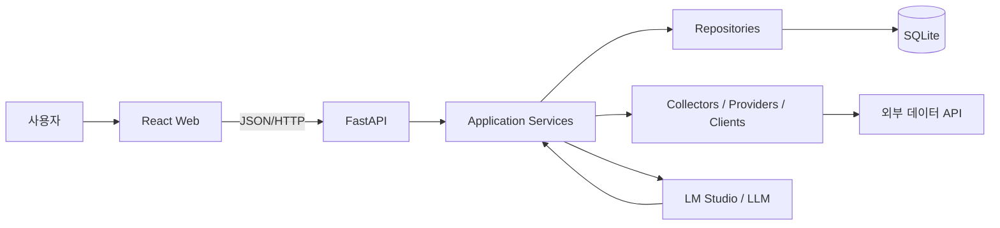
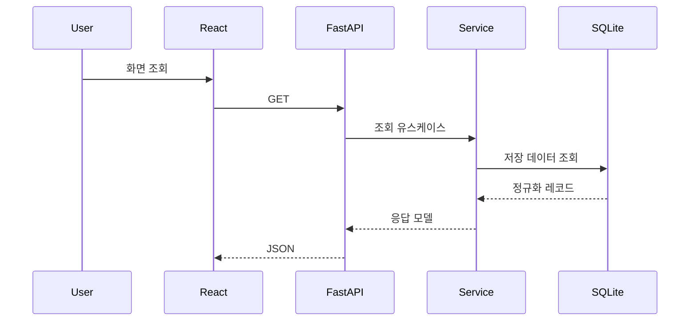
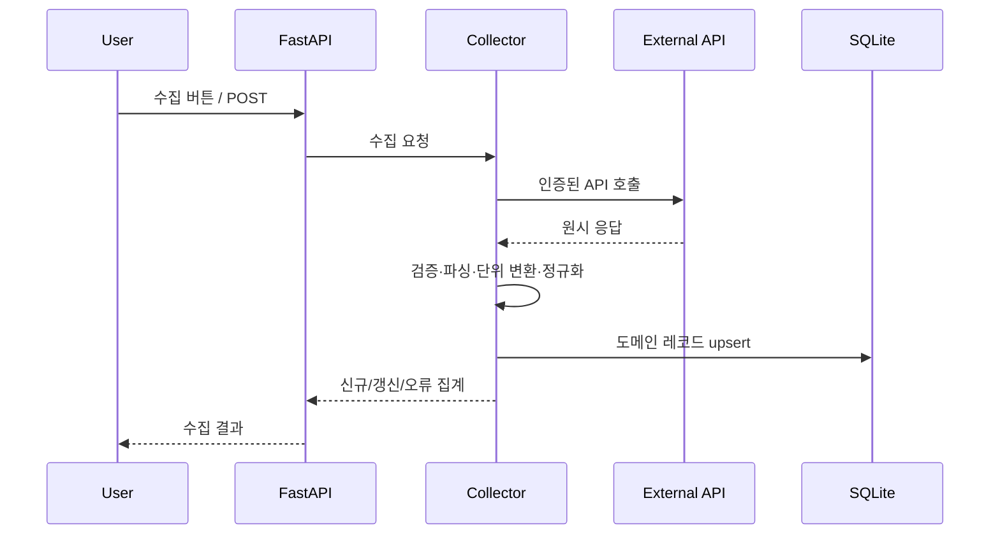
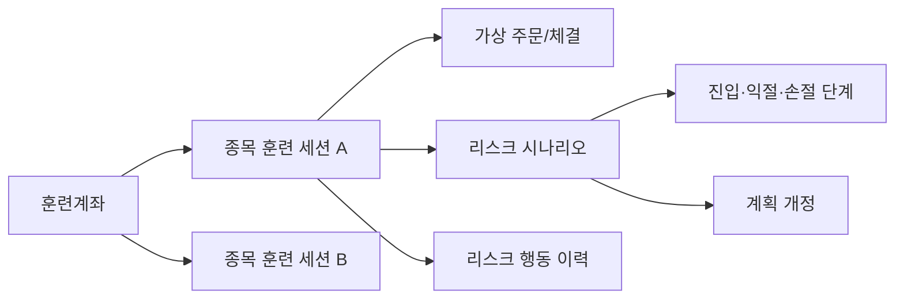

# DrCT Asset Office Architecture

> 기준일: 2026-07-21
> 대상: 현재 저장소의 React/FastAPI/SQLite 애플리케이션

## 1. 문서 목적

이 문서는 DrCT Asset Office의 실행 구조, 계층별 책임, 데이터 흐름, 주요 업무 도메인과 확장 규칙을 설명합니다. 설치와 실행은 [README.md](./README.md), UI 규칙은 [DESIGN.md](./DESIGN.md)를 참고합니다.

## 2. 시스템 컨텍스트



현재 배포 형태는 한 PC에서 프런트엔드와 백엔드를 실행하고 SQLite를 공유하는 로컬 우선 구조입니다. 백엔드는 데이터 수집, 정규화, 업무 규칙과 영속성을 담당하고 프런트엔드는 조회, 입력, 시각화와 사용자 상태를 담당합니다.

## 3. 저장소 구조

```text
drct-asset-office/
  backend/
    app/
      api/             FastAPI 라우터
      schemas/         Pydantic 요청·응답 모델
      services/        업무 유스케이스와 규칙
      repositories/    DB 질의와 저장
      entities/        SQLAlchemy ORM 엔터티
      collectors/      외부 데이터 수집·정규화 흐름
      providers/       제공자별 어댑터
      clients/         HTTP/SDK 클라이언트
      core/            설정, DB, 로깅, 런타임 초기화
      llm/             LLM 클라이언트와 분석 지원
      jobs/            배치 작업 확장 위치
      sql/             초기 스키마 SQL
      utils/           공통 유틸리티
      main.py          FastAPI 조립과 시작점
    tests/             백엔드 단위·API 테스트
  frontend/
    src/
      api/             공통 HTTP 클라이언트
      app/             앱 설정과 셸
      components/      재사용 UI
      layouts/         화면 레이아웃
      pages/           라우트 단위 업무 화면
      router/          라우트 레지스트리
      services/        도메인 저장소 조합
      types/           TypeScript 계약
      utils/           표시·계산 유틸리티
      index.css        공통 및 업무 화면 스타일
  scripts/             DB 초기화와 운영 보조 스크립트
  db/                  로컬 SQLite DB
  data/                정적·가공 데이터 및 파일 자원
  reports/             생성 보고서
  .env.example         런타임 설정 예시
```

## 4. 백엔드 아키텍처

### 4.1 조립과 시작

`backend/app/main.py`가 FastAPI 애플리케이션을 생성하고 도메인 라우터를 등록합니다.

시작 시 수행하는 핵심 작업:

1. 로깅 초기화
2. 런타임 스키마 보정
3. 시장 데이터 수집 스키마 점검
4. 시장 시그널 스키마 점검
5. 로컬 프런트엔드용 CORS 설정
6. `/static`, `/uploads` 정적 경로 마운트

개발 CORS 허용 대상은 `127.0.0.1:5173`과 `localhost:5173`입니다.

### 4.2 계층과 의존 방향

```text
API Router -> Schema -> Service -> Repository -> Entity/Database
                         |
                         +-> Provider/Collector/Client
                         +-> LLM
```

| 계층 | 책임 | 포함하면 안 되는 것 |
| --- | --- | --- |
| API | HTTP 파라미터, 상태 코드, 응답 계약 | SQL, 제공자별 파싱 규칙 |
| Schema | 입력 검증과 직렬화 계약 | DB 세션, 네트워크 호출 |
| Service | 유스케이스, 계산, 상태 전이, 트랜잭션 경계 | 화면 표시 로직 |
| Repository | 질의, 저장, 엔터티 변환 | HTTP 응답 형태, 외부 API 호출 |
| Entity | 영속 데이터 모델과 관계 | 외부 제공자 필드 원본 |
| Provider/Client | 외부 시스템 호출과 제공자별 계약 | 화면 상태, 장기 업무 흐름 |
| Collector | 페이지 순회, 정규화, 중복 처리, 수집 결과 집계 | 원시 응답 DB 저장 |

라우터가 복잡한 계산이나 직접 SQL을 가지지 않도록 하고, 여러 API에서 공유되는 규칙은 서비스에 둡니다. 저장소는 도메인 의미가 있는 메서드를 제공하고 세션 수명은 서비스 또는 요청 경계에서 관리합니다.

### 4.3 설정과 데이터베이스

`backend/app/core/config.py`는 루트 `.env`를 읽습니다. 기본 DB는 `db/drct_asset.sqlite3`이며 `backend/app/core/database.py`가 SQLAlchemy 엔진과 세션을 제공합니다.

SQLite 운영 설정:

- busy timeout: 10초
- journal mode: WAL
- synchronous: NORMAL
- 단일 로컬 애플리케이션 중심

초기 스키마는 `backend/app/sql/schema.sql`과 `scripts/init_db.py`가 담당합니다. 이후 추가된 기능의 호환 스키마는 시작 시점의 ensure 함수와 마이그레이션 코드가 보정합니다. 신규 테이블 또는 컬럼을 추가할 때는 새 DB 초기화와 기존 DB 업그레이드 경로를 모두 확인해야 합니다.

## 5. 프런트엔드 아키텍처

### 5.1 앱 조립

`frontend/src/main.tsx`가 React를 시작하고 `App.tsx`, `app/AppShell.tsx`를 거쳐 라우터를 렌더링합니다. `frontend/src/router/routeRegistry.tsx`가 경로, 페이지 컴포넌트와 제목의 기준점입니다.

### 5.2 계층

```text
Route Registry
  -> Page
     -> Domain/Shared Components
     -> Service Repository
        -> apiClient
           -> FastAPI
```

- **Pages**: 라우트 단위 데이터 로딩과 화면 상태를 조정합니다.
- **Components**: 차트, 모달, 입력 도구처럼 반복되는 UI를 캡슐화합니다.
- **Services**: 도메인별 API 저장소와 개발용 mock 저장소를 조립합니다.
- **API client**: base URL, timeout, JSON 처리와 공통 오류를 담당합니다.
- **Types**: 서버 계약과 화면 모델을 TypeScript로 고정합니다.

`VITE_DATA_SOURCE`의 기본값은 `api`입니다. 일부 개발 경로는 mock을 지원하지만, 모든 도메인이 mock 전환 대상인 것은 아닙니다. 신규 기능은 저장소 인터페이스를 먼저 정의하고 페이지에서 `fetch`를 직접 호출하지 않는 방식을 우선합니다.

### 5.3 상태와 갱신

현재는 페이지와 도메인 컴포넌트의 React 상태가 중심입니다. 서버 변경 뒤 화면 데이터가 영향을 받으면 다음 중 하나를 명시적으로 수행합니다.

1. 저장 응답을 로컬 상태에 반영
2. 서버 데이터를 다시 조회
3. 부모 페이지에 변경 이벤트를 전달해 관련 집계를 갱신

모달을 다시 열거나 토글을 반복했을 때 오래된 계획선이 보이지 않도록, 저장 성공을 서버 상태의 확정 시점으로 사용합니다.

## 6. 업무 도메인

| 도메인 | 백엔드 구성 예 | 프런트엔드 화면 예 |
| --- | --- | --- |
| 종목·관심종목 | stocks, watchlist, stock_tracking | 종목 목록, 관심종목, 추적 |
| 가격·수급·재무 | stock_prices, market_metrics, investor_flows, financials | 일봉, 수급, 재무 요약 |
| 뉴스·공시 | news, disclosures, collectors | 뉴스, 공시, 수집 이력 |
| 시장 분석 | market_indexes, indicators, signals, themes, trends | 시장지수, 시그널, 테마, 트렌드 |
| 브리핑·KMS | economic_briefing, telegram, kms | 경제/Telegram 브리핑, KMS |
| 자문·분석 | analysis, reports, advisory_packages, prompt_templates | 분석 결과, 근거 패키지 |
| 매매 기록 | trade_journals, trade_reviews | 일지, 캘린더, 리뷰 |
| 매매 연구 | backtest, pattern_research | 백테스트, 패턴 AI 연구 |
| 매매훈련 | trade_training, risk calculator | 계좌관리매매 훈련, 종목 훈련 |
| 시스템 | schema_comments, architecture | 스키마 설명, 아키텍처 정책 |

라우터 파일 수가 많더라도 위 업무 경계를 유지합니다. 공통이라는 이유만으로 서로 다른 도메인의 상태 전이를 하나의 서비스에 합치지 않습니다.

## 7. 핵심 데이터 흐름

### 7.1 저장 데이터 조회



GET 조회는 외부 API를 암묵적으로 호출하지 않습니다. 데이터가 없거나 오래되었더라도 조회 응답에서 상태를 알리고 수집은 별도 명령으로 수행합니다.

### 7.2 명시적 외부 수집



### 원시값 처리 원칙

- API 원시 응답과 원시 필드 묶음은 DB에 저장하지 않습니다.
- 서비스가 사용하는 가격, 등락률, 거래량, 금액은 수집 경계에서 타입과 단위를 정규화합니다.
- 제공자별 부호, 문자열 포맷, 퍼센트 단위 차이는 어댑터에서 해소합니다.
- `KIWOOM_REST_LOG_RAW_PREVIEW=false`를 기본으로 유지하고 비밀값이나 응답 전문을 로그에 남기지 않습니다.
- 장애 분석에는 요청 식별자, 제공자, 상태 코드, 건수와 정규화 오류처럼 최소 메타데이터를 사용합니다.

### 7.3 Kiwoom 조건검색

1. 사용자가 조건식 목록 또는 조건 결과 조회를 명시적으로 요청합니다.
2. Kiwoom 클라이언트가 제공자 응답을 수신합니다.
3. 현재가, 기준가, 등락률, 거래량, 거래대금의 타입과 단위를 정규화합니다.
4. 화면 조회 결과를 반환하거나 필요한 도메인 결과만 저장합니다.
5. API 원시 응답 자체는 DB에 남기지 않습니다.

등락률처럼 제공자 필드 의미가 혼동되기 쉬운 값은 원시 숫자를 그대로 표시하지 않고 가격과 기준가의 관계 및 API 명세를 함께 검증합니다.

### 7.4 계좌 기반 매매훈련



- 훈련계좌는 현금, 평가자산, 실현손익과 여러 종목 세션을 집계합니다.
- 종목 세션은 차트 기준일, 보유수량, 평균단가, 주문·체결 이력을 관리합니다.
- 리스크 시나리오는 진입, 익절, 전량손절, 분할손절 단계를 구분합니다.
- 주문 미리보기는 계획 대비 위험, 예상 현금, 수수료와 잔여수량을 계산합니다.
- 계획 수정은 저장 후 개정 이력과 행동 이력에 반영하고 메인 차트는 최신 계획을 다시 조회합니다.
- 매수·매도 실행은 DB 안의 가상 체결이며 실제 증권사 주문 호출로 연결하지 않습니다.

손절과 익절은 서비스 경계에서 서로 다른 유형으로 정규화합니다. 이전 데이터의 별칭이 있다면 호환 변환은 한곳에서 처리하고 신규 저장값은 현재 도메인 타입을 사용합니다.

### 7.5 LLM 분석

LLM 입력은 저장된 뉴스, 공시, 지표와 사용자가 선택한 근거를 조합해 만듭니다. 프롬프트 템플릿과 근거 패키지를 분리해 재현성을 높이며, LLM 결과는 사실 원문을 대체하지 않는 파생 분석으로 취급합니다.

## 8. API 계약과 오류 처리

- 요청과 응답은 Pydantic 스키마로 검증합니다.
- 숫자 계산은 가능한 한 서버의 단일 규칙을 사용하고 프런트는 표시 포맷에 집중합니다.
- 업무 오류는 사용자가 수정할 수 있는 메시지와 적절한 HTTP 상태 코드로 반환합니다.
- 외부 제공자 오류와 내부 검증 오류를 구분합니다.
- 수집 작업은 전체 성공만 가정하지 않고 처리, 신규, 갱신, 건너뜀, 실패 건수를 반환합니다.
- 삭제·종료·주문 실행과 같은 상태 변경은 재시도 시 중복 결과가 생기지 않도록 식별자와 현재 상태를 확인합니다.

## 9. 외부 연동

| 연동 | 역할 | 기본 상태/주의 |
| --- | --- | --- |
| Kiwoom REST | 종목 시세, 지수, 조건검색 | 비활성·모의 서버 기본, 주문 API 차단 |
| OpenDART | 공시와 기업 정보 | API 키 필요 |
| Naver | 뉴스 검색 | Client ID/Secret 필요 |
| KRX/data.go.kr/KIS | 종목·시장 데이터 보완 | 제공자별 키와 제한 확인 |
| BOK ECOS/KOSIS/FRED | 거시경제 지표 | 선택적 활성화 |
| YouTube | 경제 콘텐츠 메타데이터·자막 | 기본 비활성 |
| Telegram | 채널 수집·브리핑 | 세션 파일과 비밀값 보호 |
| LM Studio | 로컬 LLM 분석 | 로컬 엔드포인트 필요 |

외부 연동은 `clients`, `providers`, `collectors` 중 역할에 맞는 위치에 추가합니다. 제공자 응답 모델이 서비스나 엔터티로 직접 누출되지 않게 합니다.

## 10. 런타임과 운영

개발 기본 주소:

- Frontend: `127.0.0.1:5173`
- Backend: `127.0.0.1:8000`
- LM Studio: `127.0.0.1:1234/v1`
- SQLite: `db/drct_asset.sqlite3`

백엔드는 `/health`로 상태를 확인할 수 있습니다. 생성 파일은 용도에 따라 `data`, `reports`, `backend/uploads` 아래에 두며, 비밀값과 로컬 세션은 버전 관리에서 제외합니다.

현재 구조는 별도 메시지 브로커나 상시 스케줄러를 전제로 하지 않습니다. 오래 걸리는 수집을 백그라운드 작업으로 확장할 경우 작업 상태, 재시도, 중복 방지와 취소 계약을 먼저 정의해야 합니다.

## 11. 테스트 전략

현재 `backend/tests`는 다음 위험 영역을 중심으로 검증합니다.

- API 계약과 기본 CRUD
- 종목 가격 요약과 기술지표
- 시장 시그널 준비 상태
- 관심종목과 스키마 설명
- Kiwoom 외부 연동 경계
- 자문 근거 패키지
- 매매훈련 리스크 계산
- 주문 미리보기 경고와 리스크 행동 이력

기본 검증 명령:

```powershell
python -m pytest backend/tests -q
python -m compileall backend/app
Set-Location frontend
npm run build
```

상태 전이가 큰 기능은 서비스 테스트와 API 테스트를 함께 추가합니다. 차트와 모달 변경은 데스크톱·모바일 화면에서 스크롤, 겹침, 저장 후 재조회까지 확인합니다.

## 12. 확장 규칙

### 새 백엔드 기능

1. 도메인과 소유 경계를 정합니다.
2. 요청·응답 스키마를 정의합니다.
3. 서비스에 유스케이스와 업무 규칙을 구현합니다.
4. 필요한 저장소와 엔터티를 추가합니다.
5. 라우터를 얇게 유지하고 `main.py`에 등록합니다.
6. 신규 DB와 기존 DB 모두에 적용되는 스키마 경로를 마련합니다.
7. 서비스 및 API 테스트를 추가합니다.

### 새 외부 데이터 제공자

1. 설정과 비밀값을 `.env.example`에 문서화합니다.
2. 클라이언트에서 인증, timeout, rate limit을 처리합니다.
3. 제공자 응답을 collector/provider 경계에서 도메인 값으로 정규화합니다.
4. 원시 응답을 DB에 저장하지 않습니다.
5. 수집은 명시적 POST 명령으로 노출하고 GET 조회와 분리합니다.

### 새 프런트엔드 화면

1. `routeRegistry.tsx`에 경로와 제목을 등록합니다.
2. `types`와 서비스 저장소 계약을 먼저 정의합니다.
3. 페이지는 데이터 로딩과 작업 흐름을 조정하고 반복 UI는 컴포넌트로 분리합니다.
4. 저장 성공 후 영향을 받는 서버 데이터를 갱신합니다.
5. [DESIGN.md](./DESIGN.md)의 모달, 차트, 접근성 규칙을 확인합니다.

## 13. 현재 제약과 개선 방향

- SQLite와 시작 시 스키마 보정은 로컬 단일 인스턴스에 적합하지만 규모가 커지면 정식 마이그레이션 도구와 서버 DB가 필요합니다.
- 일부 대형 페이지와 `index.css`는 기능이 누적되어 있어 도메인 컴포넌트와 스타일 모듈 단위의 점진적 분리가 유효합니다.
- API/mock 저장소 지원 범위가 도메인별로 다르므로 테스트 목적과 실제 실행 모드를 문서화해야 합니다.
- 외부 수집이 동기 요청에 묶인 영역은 장시간 실행, 취소, 재시도 경험을 개선할 여지가 있습니다.
- 현재 로컬 사용을 전제로 한 인증·권한 경계는 다중 사용자 배포 전에 별도로 설계해야 합니다.
- 실제 증권사 주문 기능은 의도적으로 범위 밖이며 `KIWOOM_REST_BLOCK_ORDER_API=true`를 유지합니다.

## 14. 아키텍처 불변 조건

다음 조건은 기능 추가 시에도 유지합니다.

1. GET 조회는 외부 수집을 암묵적으로 실행하지 않는다.
2. API 원시 응답은 DB에 저장하지 않는다.
3. 제공자별 형식은 어댑터 경계 밖으로 노출하지 않는다.
4. 업무 상태 전이는 서비스에서 검증한다.
5. 프런트엔드는 저장 성공 전의 임시 상태와 서버 확정 상태를 구분한다.
6. 가상 매매훈련과 실제 주문 연동을 혼합하지 않는다.
7. 비밀값과 개인 세션 데이터는 저장소와 일반 로그에 남기지 않는다.
